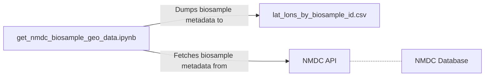

# NMDC

This directory contains information about retrieving the geographical origin coordinates of biosamples in the NMDC database.

## References

- [Using Python to access the NMDC API](https://docs.microbiomedata.org/runtime/nb/api_access_via_python/)
- [NMDC Schema documentation page about the `Biosample` schema class](https://microbiomedata.github.io/nmdc-schema/Biosample/)
- [NMDC Schema documentation page about the `lat_lon` schema slot](https://microbiomedata.github.io/nmdc-schema/lat_lon/)
