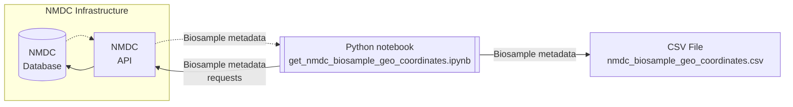

# NMDC

This directory contains a Python notebook you can use to fetch location-related metadata about biosamples residing
in the NMDC database—via the NMDC API—and store that metadata in a CSV file. This directory also contains an example
of such a CSV file.

Here's a diagram depicting the relationships between the NMDC database, the Python notebook in this directory,
and the CSV file in this directory.

## References

Here are some other documents you may find helpful when exploring the contents of this directory.

- [Using Python to access the NMDC API](https://docs.microbiomedata.org/runtime/nb/api_access_via_python/)
- [NMDC Schema documentation page about the `Biosample` schema class](https://microbiomedata.github.io/nmdc-schema/Biosample/)
- [NMDC Schema documentation page about the `lat_lon` schema slot](https://microbiomedata.github.io/nmdc-schema/lat_lon/)
